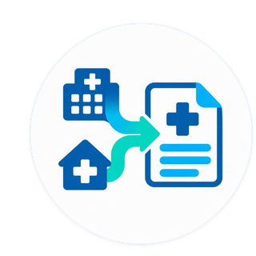

<p align="center">
  
</p>

# Cito — interactive proof of concept

**Live demo: https://milton-villegas.github.io/cito/**
**Repository: https://github.com/milton-villegas/cito**

Cito is a rules-based proof of concept that organizes authorized COPD documents available in a GP practice, together with a hospital discharge report, into one structured, chronological and source-linked overview. The GP reviews the information and remains responsible for every clinical and aftercare decision.

## Proof of concept · synthetic data · not for clinical use

- All patient and clinician information in this demo is **synthetic**. "John Doe", the patient ID, the hospital and the document contents were created for demonstration purposes.
- This is **not a medical device** and is **not for clinical use**.
- It does **not contain or process real patient information**. There is no backend, no account, no database and no data transmission.
- It demonstrates a **proposed workflow** only.
- The field reading is **simulated with predefined, rules-based fields** held in the page itself. Nothing is inferred from the document at runtime.
- The proposed workflow uses **no AI, generative AI, LLM, machine learning, prediction or automated clinical decision-making**.
- **Security, authentication, interoperability, legal compliance and clinical validation would all be required before any real pilot.**

## What the demo shows

Three workflow views inside one restrained module:

1. **Patient record** — a short chronological COPD timeline, the latest documented pulmonary function, the documents already held by the practice, and the newly received hospital discharge report waiting for review. Practice documents and the new hospital report are shown as separate sources.
2. **Document review** — the discharge report on the left and a limited set of predefined fields on the right: admission and discharge dates, diagnosis, documented trigger, oxygen on admission and at discharge, medication at discharge (collapsed until opened) and the hospital's follow-up recommendations. Each field offers **View source**, which highlights the exact supporting sentence in the document. Information that the report does not contain stays visible as an open point.
3. **COPD overview** — a clean one-page document built from the reviewed fields: patient identification, the latest hospital event, the COPD timeline, the recent event facts, the latest documented pulmonary function, the exact medication documented at discharge, the hospital's follow-up recommendations, GP ownership and follow-up date, the unresolved points, the review timestamp and a numbered source index.

Unknown information stays unknown: the exact date of the previous exacerbation and the measurement date of the spirometry are shown as not documented, because the source documents do not contain them.

## What Cito does not do

Cito does not diagnose, prescribe, recommend treatment, select medication, calculate risk or choose the aftercare plan. It does not decide whether two documents describe the same episode, does not reconcile current medication and does not approve information clinically.

The demo ends once the reviewed overview exists. The GP uses the reviewed overview to define and coordinate the patient's aftercare plan outside Cito, including any specialist, education, medication-support or home-care involvement.

## Demo video

`Cito_Demo.mp4` is a screen recording of the real interface (not a separate mockup): the patient record opens, the hospital discharge report is reviewed, the supporting source sentence is highlighted, the fields are verified, GP follow-up is recorded, and the COPD overview is generated and saved. Specs: 1920×1080, 30 fps, ~33 seconds, no audio.

To regenerate it after an interface change, from a machine with Python and a Chromium browser available through Playwright:

```sh
pip install playwright imageio-ffmpeg
python -m playwright install chromium
python record_cito_demo.py
```

`record_cito_demo.py` drives `index.html` with the real buttons (`#openDoc`, `#medToggle`, the `View source` link, `#verifyBtn`, `#continueBtn`, `#createBtn`, `#saveBtn`) at a readable pace, records the session, and encodes the result to `Cito_Demo.mp4` with `ffmpeg -r 30 -fps_mode cfr -c:v libx264 -crf 18 -an`.

## Run it locally

No installation, build step, backend or internet connection is required.

1. Download or clone this folder.
2. Open `index.html` in a current desktop browser (Chrome, Edge, Firefox or Safari).

Optionally serve it locally, for example with `python3 -m http.server`, then open the address shown in the terminal. Designed for desktop widths; tested at 1440×900 and 1920×1080.

## Publish with GitHub Pages

The folder is static and uses relative paths only, so it works from a repository subpath as well as from `file://`. A `.nojekyll` file is included so that all files are served unprocessed.

This repository is already published at the address above, using branch `main` and the repository root. To set the same up in another repository:

1. Push the contents of this folder to a GitHub repository (this folder can be the repository root, or a folder such as `docs/`).
2. In the repository, open **Settings → Pages**.
3. Under **Build and deployment**, set **Source** to **Deploy from a branch**.
4. Choose the branch (for example `main`) and the folder (`/root` or `/docs`, matching where you placed these files). Select **Save**.
5. Wait for the first deployment, then open the URL GitHub shows on the same settings page.

No secrets, tokens, environment files or analytics are included, and no external resources are requested.

## Recommended click sequence for a live demonstration

1. **Review document** — open the newly received hospital discharge report.
2. **Show 5 entries** — expand the medication documented at discharge.
3. **View source** — on "Hospital follow-up" (or any other field) to highlight the exact sentence in the report.
4. **Verify fields** — the screen status changes from *Pending review* to *Reviewed* and records the review time.
5. **Continue with GP follow-up** — the follow-up date and GP ownership are recorded for the session.
6. **Create COPD overview** — the one-page overview is produced from the reviewed fields.
7. **Save to record** — the demo confirms *Saved in this demo session*. **Print overview** uses the browser print dialogue; **Start over** resets everything.

Every visible control works, and the whole route is operable with the keyboard (Tab and Enter). "Other actions" holds the alternatives a GP could choose instead: refer for specialist review, request missing information, or redirect or decline with reason.

## Current limitations

- The field reading is represented by predefined values; no document parsing runs in the browser.
- One synthetic patient and one synthetic hospital report are included. There is no search, login, audit trail, versioning or persistence — "saving" applies to the current browser session only and is discarded on reload.
- No hospital or practice system integration, no message transport and no document import exist.
- Accessibility, wording and layout have had only basic checks.
- Before a real pilot the following would be required: information-security and data-protection assessment, authentication and role-based access, audit logging, a defined document transport and interoperability route, handling of scanned or image-only documents, regulatory classification, and clinical validation of every predefined field with the clinicians who would use it.
- No claim is made about time saved, cost saved, fewer hospital admissions or better outcomes. Those are outcomes a controlled pilot would need to measure.

## Data and privacy

This demo contains **no real patient data**. The patient, identifiers, hospital, clinician role and document text are synthetic and were written for demonstration. Nothing is uploaded, stored or shared: there is no backend, no cookies, no local storage, no analytics and no third-party requests. Opening the page makes no network calls.

## Licence

No licence has been selected. All rights are reserved by the project team until the team chooses one.
